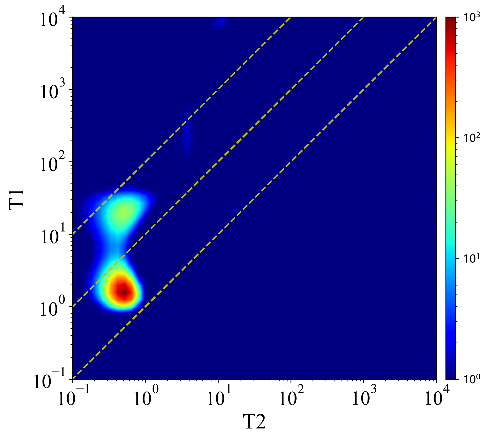
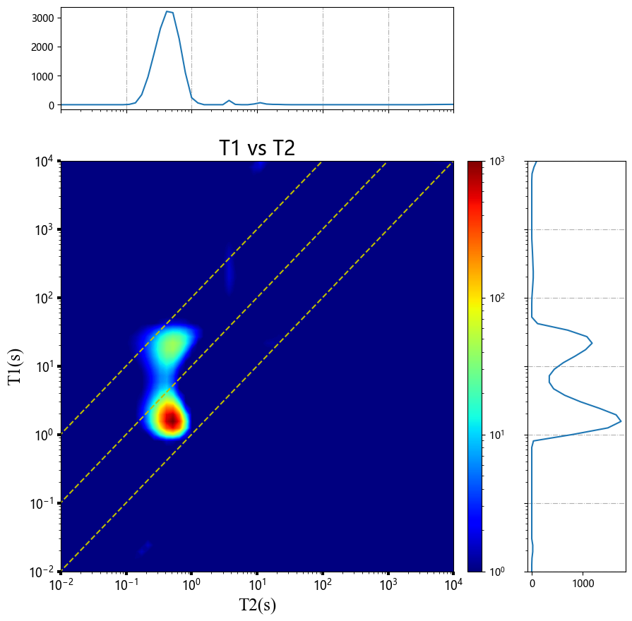

# NMR_T1T2_distribution_plot_helper

#### Description
A python tool to help plot NMR T1 and T2 chart.

#### Software Architecture
based on python 3.X, needs os, numpy, matplotlib, warning 3rd module. 

#### Installation

1. demo_use.ipynb is show the results of the method.
2. plot_T1T2.py is the function of plot.
3. data folder is the example data that neeeded.

#### Demo Presentation
  
 

#### E-mail
xbs150@163.com

